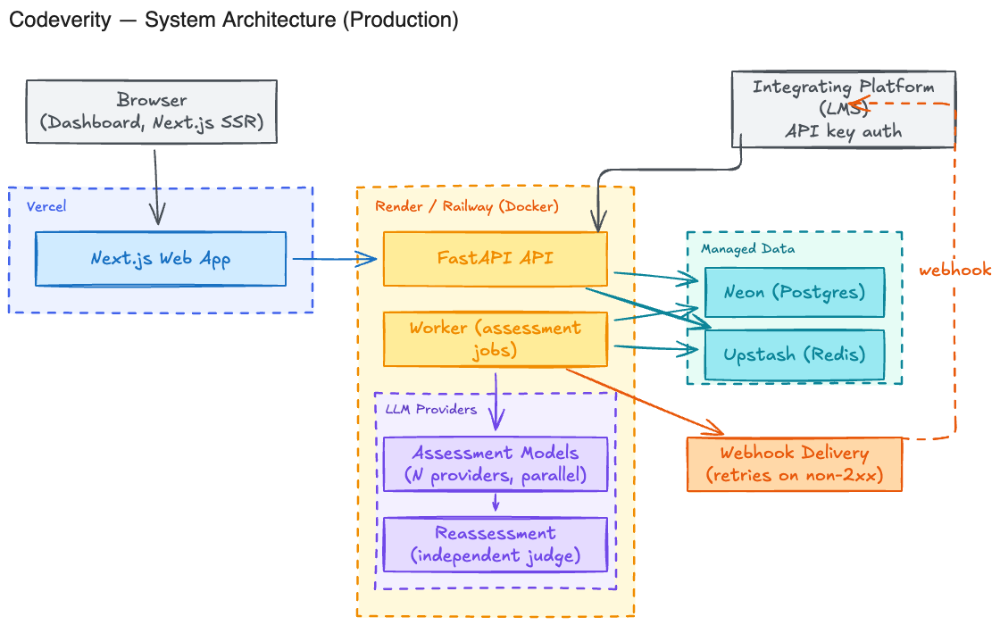

# Codeverity API

<br/>

## Status at a Glance

| Phase | Scope | Status |
|---|---|---|
| 0 | Scaffold, Docker, health checks | Done |
| 1 | Auth, organizations, API keys | In progress: Google and GitHub sign in done |
| 2 | Assessment CRUD, job queue | Not started |
| 3 | Multi model orchestration | Not started |
| 4 | Webhooks | Not started |
| 5 | Usage, logs, rate limiting | Not started |
| 6 | Migrations, deploy, hardening | Not started |

<br/>

## What This Is

Codeverity is a FastAPI backend for multi model code assessment.

It takes a code submission, sends it to several language models at once, runs an independent judge pass over their output, then returns one validated result to the integrating platform.

This file is the build roadmap. It tracks what exists, what is next, and the shape of the API to come.

<br/>

## System Architecture



Vercel hosts the frontend. Render or Railway runs the API and worker in Docker. Neon and Upstash hold Postgres and Redis.

The worker fans a submission out to several models, runs an independent judge pass, then persists the result and fires a webhook.

See [assessment-lifecycle.png](docs/diagrams/assessment-lifecycle.png) for that flow, and [docs/diagrams](docs/diagrams/) for the editable sources.

<br/>

## Project Layout

```
apps/api/
├── app/
│   ├── main.py          App factory and router wiring
│   ├── core/
│   │   ├── config.py     Settings from environment variables
│   │   └── security.py   JWT issuing and verification
│   ├── db/
│   │   ├── session.py     Postgres session
│   │   ├── redis.py       Shared Redis client
│   │   └── base.py        Declarative base and model import hub
│   ├── models/            SQLAlchemy models: organization, user
│   ├── schemas/           Pydantic request and response shapes
│   ├── services/
│   │   ├── auth/           Google and GitHub OAuth, user resolution, state and exchange codes
│   │   └── orchestration/  Model dispatch and reassessment (Phase 3, empty)
│   ├── api/
│   │   ├── health.py      Unversioned health checks
│   │   └── v1/
│   │       ├── router.py   Versioned API routes
│   │       └── auth.py     Google and GitHub sign in endpoints
│   └── worker/             Background job worker (Phase 2, empty)
├── alembic/                Migrations
├── tests/
├── docs/diagrams/          Architecture diagrams
└── Dockerfile
```

`services/orchestration` and `worker` are still empty placeholders for later phases. Everything else above is real, working code.

<br/>

## Tech Stack

- FastAPI and Uvicorn for the web server
- SQLAlchemy and asyncpg for the database
- Redis for the job queue
- Pydantic Settings for configuration
- pytest and ruff for testing and linting
- Docker locally, Render or Railway in production, Neon and Upstash for managed data

<br/>

## Phase 0: Scaffold (Done)

- Dockerfile wired into the repo's docker-compose
- Settings read from `.env`
- Async database session
- `GET /health` and `GET /health/ready`
- pytest and ruff configured

<br/>

## Phase 1: Auth, Organizations, API Keys

The dashboard already has UI for this. The data model follows what it expects.

- `organizations` table: name, slug, created at. Done.
- `users` table: email, password hash, auth provider, Google sub, GitHub id, role. Done.
- JWT session auth for login, signup, and password reset. JWT issuing is done
  (`app/core/security.py`); password login itself is not built yet.
- `api_keys` table: name, hashed secret, environment, last used. Not started.
- API key auth for the public API. Not started.
- Endpoints for email/password auth and API key management. Not started.

<br/>

### Google and GitHub Sign In (Done)

The backend owns the OAuth handshake, not the frontend, since each provider is just another way into the same user table. Both follow the same flow through a shared resolver, implemented in `app/services/auth/` and `app/api/v1/auth.py`, covered by `tests/test_google_auth.py` and `tests/test_github_auth.py`.

**Flow:** the browser hits `/v1/auth/{provider}/login`, which sends it to Google or GitHub. The provider calls back to `/v1/auth/{provider}/callback`, where the API exchanges the code, reads the profile, and resolves the user. It then redirects to the frontend with a one time code, which the frontend exchanges for real tokens via `POST /v1/auth/exchange`. Both providers share this callback and exchange step, so the frontend doesn't need to know which one was used.

**On callback:**
- A known account (by Google sub or GitHub id) logs in.
- A new account creates a user and auto creates an organization named after them.
- A new account matching an existing verified email links to that account instead of duplicating it. An existing, unverified match is rejected with a 409 rather than linked.
- GitHub only: a user with no verified email on their GitHub account is rejected with a 409, since GitHub doesn't always return one on the base profile.

**Frontend wiring (Done):**
- The "Continue with Google" and "Continue with GitHub" buttons in `SocialButtons.tsx` link straight to `/v1/auth/{provider}/login`
- `app/(auth)/auth/callback/route.ts` calls `/v1/auth/exchange` and sets the session as an httpOnly cookie
- `middleware.ts` redirects `/dashboard/*` to `/login` when that cookie is missing (presence only, not signature/expiry, since the API doesn't verify tokens on any route yet either)

<br/>

## Phase 2: Assessments

Matches the shapes already defined in the frontend.

- `assessments` table: status, language, assignment, submission, score
- `POST /v1/assessments` creates a row and queues a job
- `GET /v1/assessments/{id}` and `.../result`
- A worker process that consumes the queue

<br/>

## Phase 3: Multi Model Orchestration

The core of the product. See [assessment-lifecycle.png](docs/diagrams/assessment-lifecycle.png).

- One interface, one adapter per model provider
- Fan out to N models in parallel
- An independent judge pass that resolves disagreement into one result
- Timeout and retry handling, so one bad model does not fail the whole run

<br/>

## Phase 4: Webhooks

- `webhook_endpoints` and `webhook_deliveries` tables
- Fire `assessment.completed` and `assessment.failed`
- Retry deliveries with backoff
- Sign payloads with HMAC

<br/>

## Phase 5: Usage, Logs, Rate Limiting

- Request logging middleware
- `GET /v1/usage` and `GET /v1/logs`
- Per key rate limiting backed by Redis

<br/>

## Phase 6: Migrations and Deploy

- Alembic for migrations. Done: set up in `alembic/`, first migration creates
  `organizations` and `users`. New models just need `alembic revision --autogenerate`.
- Deploy config for Render or Railway
- Point production at Neon and Upstash
- CORS locked to real origins
- A backend CI workflow

<br/>

## Local Development

```bash
make api-up                          # build and start api, worker, db, redis
make api-logs                        # follow logs
make api-test                        # run tests
make api-migrate                     # apply pending migrations
make api-migration name="add x"      # generate a new migration from model changes
make down                            # stop everything
```

`GET localhost:8000/health/ready` should return ok once the stack is up. Docs live at `localhost:8000/docs`.
