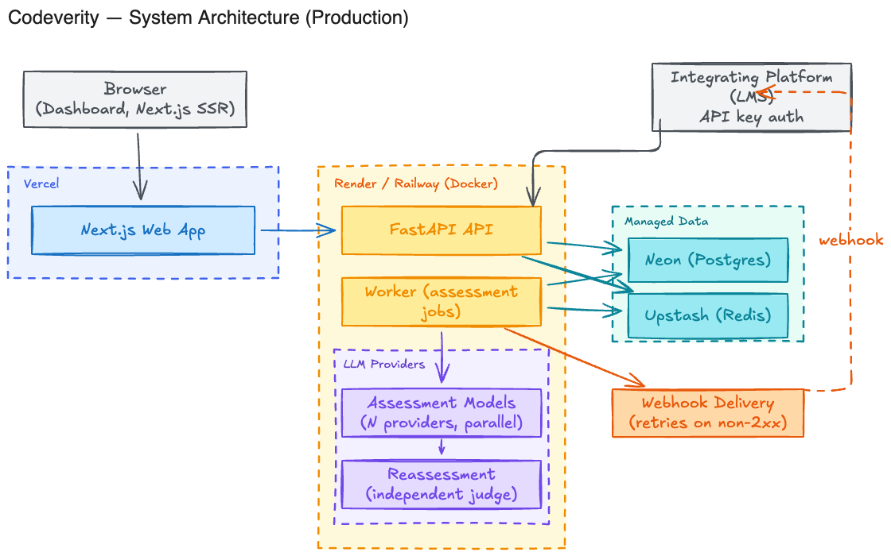

# Codeverity API

<br/>

## Status at a Glance

| Phase | Scope | Status |
|---|---|---|
| 0 | Scaffold, Docker, health checks | Done |
| 1 | Auth, organizations, API keys | Done |
| 2 | Assessment CRUD, job queue | Done |
| 3 | Multi model orchestration | Done |
| 4 | Webhooks | Done |
| 5 | Usage, logs, rate limiting | Done |
| 6 | Migrations, deploy, hardening | Not started |

<br/>

## What This Is

Codeverity is a FastAPI backend for multi model code assessment.

It takes a code submission, sends it to several language models at once, runs an independent judge pass over their output, then returns one validated result to the integrating platform.

This file is the build roadmap. It tracks what exists, what is next, and the shape of the API to come.

<br/>

## System Architecture



Vercel hosts the frontend. Render or Railway runs the API and worker in Docker. Neon and Upstash hold Postgres and Redis.

The worker fans a submission out to several models, runs an independent judge pass, then persists the result and fires a webhook.

See [assessment-lifecycle.png](docs/diagrams/assessment-lifecycle.png) for that flow, and [docs/diagrams](docs/diagrams/) for the editable sources.

<br/>

## Project Layout

```
apps/api/
├── app/
│   ├── main.py          App factory and router wiring
│   ├── core/
│   │   ├── config.py     Settings from environment variables
│   │   └── security.py   JWT issuing and verification
│   ├── db/
│   │   ├── session.py     Postgres session
│   │   ├── redis.py       Shared Redis client
│   │   └── base.py        Declarative base and model import hub
│   ├── models/            SQLAlchemy models: organization, user
│   ├── schemas/           Pydantic request and response shapes
│   ├── services/
│   │   ├── auth/           OAuth, OTP codes, user resolution, state and exchange codes
│   │   ├── email/          Sendlib client for the signup OTP email
│   │   └── orchestration/  Model adapters, parallel assessment, Claude review
│   ├── api/
│   │   ├── health.py      Unversioned health checks
│   │   └── v1/
│   │       ├── router.py   Versioned API routes
│   │       └── auth.py     Google, GitHub, and email/password sign in endpoints
│   └── worker/             Background job worker
├── alembic/                Migrations
├── tests/
├── docs/diagrams/          Architecture diagrams
└── Dockerfile
```

Everything above is real, working code.

<br/>

## Tech Stack

- FastAPI and Uvicorn for the web server
- SQLAlchemy and asyncpg for the database
- Redis for the job queue
- Pydantic Settings for configuration
- pytest and ruff for testing and linting
- Docker locally, Render or Railway in production, Neon and Upstash for managed data
- Sendlib for the signup OTP email

<br/>

## Phase 0: Scaffold (Done)

- Dockerfile wired into the repo's docker-compose
- Settings read from `.env`
- Async database session
- `GET /health` and `GET /health/ready`
- pytest and ruff configured

<br/>

## Phase 1: Auth, Organizations, API Keys

The dashboard already has UI for this. The data model follows what it expects.

- `organizations` table: name, slug, created at. Done.
- `users` table: email, password hash, auth provider, Google sub, GitHub id, role. Done.
- JWT session auth for login, signup, and password reset. Done.
- `api_keys` table: name, hashed secret, environment, last used. Done.
- Dashboard endpoints to create, list, get, and revoke keys (`/v1/api-keys`). Done.
- API key auth for the public API (`get_api_caller`, `GET /v1/me`). Done.

<br/>

### Google and GitHub Sign In (Done)

The backend owns the OAuth handshake, not the frontend, since each provider is just another way into the same user table. Both follow the same flow through a shared resolver, implemented in `app/services/auth/` and `app/api/v1/auth.py`, covered by `tests/test_google_auth.py` and `tests/test_github_auth.py`.

**Flow:** the browser hits `/v1/auth/{provider}/login`, which sends it to Google or GitHub. The provider calls back to `/v1/auth/{provider}/callback`, where the API exchanges the code, reads the profile, and resolves the user. It then redirects to the frontend with a one time code, which the frontend exchanges for real tokens via `POST /v1/auth/exchange`. Both providers share this callback and exchange step, so the frontend doesn't need to know which one was used.

**On callback:**
- A known account (by Google sub or GitHub id) logs in.
- A new account creates a user and auto creates an organization named after them.
- A new account matching an existing verified email links to that account instead of duplicating it. An existing, unverified match is rejected with a 409 rather than linked.
- GitHub only: a user with no verified email on their GitHub account is rejected with a 409, since GitHub doesn't always return one on the base profile.

**Frontend wiring (Done):**
- The "Continue with Google" and "Continue with GitHub" buttons in `SocialButtons.tsx` link straight to `/v1/auth/{provider}/login`
- `app/(auth)/auth/callback/route.ts` calls `/v1/auth/exchange` and sets the session as an httpOnly cookie
- `middleware.ts` redirects `/dashboard/*` to `/login` when that cookie is missing (presence only, not signature/expiry, since the API doesn't verify tokens on any route yet either)

<br/>

### Email/Password Sign Up and Login (Done)

Signup collects name, organization, email, and password like the signup form always has, but the account starts unverified. A 6-digit code goes out by email through [Sendlib](https://sendlib.samueltuoyo.com/docs), and the frontend doesn't get a session until that code is confirmed. Implemented in `app/services/auth/otp.py`, `app/services/email/sendlib.py`, and `app/api/v1/auth.py`, covered by `tests/test_password_auth.py`.

**Flow:** `POST /v1/auth/signup` creates the user (or, if they signed up before but never verified, updates the same unverified row) and emails the code. `POST /v1/auth/verify-otp` checks it, marks the account verified, and returns tokens directly as JSON, since this is a same-origin form submit rather than a cross-site redirect. `POST /v1/auth/login` does the same after checking the password. The code lives in Redis for 10 minutes, one-time use, capped at 5 guesses.

**Frontend wiring (Done):**
- `signup/page.tsx` submits the form, then shows a code-entry step
- `login/page.tsx` submits real credentials instead of the old mocked delay
- `app/api/auth/{signup,login,verify-otp}/route.ts` proxy to the API; the latter two set the same httpOnly session cookie the OAuth callback does, via the shared `setSessionCookies` helper in `lib/auth/session.ts`

**Not handled yet:** resending a code without resubmitting the whole signup form.

<br/>

### Forgot / Reset Password (Done)

A single-use reset link emailed to the account holder. Implemented in `app/services/auth/password_reset.py`, `app/services/email/sendlib.py`, and `app/api/v1/auth.py`, covered by `tests/test_password_reset.py`.

**Flow:** `POST /v1/auth/forgot-password` takes an email and always returns the same 200 message, whether or not an account exists, so it can't be used to check which emails are registered. If there is an account, a random token goes out by email as `{FRONTEND_URL}/reset-password?token=...`. Only the SHA-256 of the token is kept in Redis (30 minutes, one-time use), and requesting a new link revokes the previous one. `POST /v1/auth/reset-password` takes the token and a new password, sets the password, and marks the account verified, since following the emailed link proves control of the inbox. It returns a message rather than tokens, so the user signs in with the new password afterwards.

**Frontend wiring (Done):**
- `forgot-password/page.tsx` submits the email and shows a "check your email" state
- `reset-password/page.tsx` reads the token from the URL, submits the new password, and shows a dedicated state for a missing, used, or expired link with a way to request a new one
- `app/api/auth/{forgot-password,reset-password}/route.ts` proxy to the API; neither sets a session cookie

<br/>

### API Keys and Key Auth (Done)

Keys look like `sk_live_4f9a2c1e_<secret>` or `sk_test_...`. The full key is
returned once, from `POST /v1/api-keys`, and is never stored or shown again.

- `prefix` (`sk_<env>_<8 hex>`) is stored in plain text and indexed, so a
  request finds its key row in one lookup.
- The full key is stored as a SHA-256 hash. Keys have ~190 bits of randomness,
  so a fast hash is right here; passwords still use bcrypt.
- `last_four` lets the dashboard show a masked key.
- Revoking sets `revoked_at`; revoked keys drop out of the list and are
  rejected by key auth on the next request. At most 25 active keys per
  organization.

Public endpoints authenticate with `Depends(get_api_caller)` from
`app/api/deps.py`. It reads `Authorization: Bearer sk_...`, finds the row by
prefix, compares hashes in constant time, rejects revoked keys, and returns an
`ApiCaller` with the key, its organization and its environment. Every failure
is the same `401 Invalid API key.`, so callers can't probe which check failed.
`last_used_at` is refreshed at most once a minute. `GET /v1/me` is the simplest
protected endpoint and is handy for checking a key.

All key rules and queries live in `app/services/api_keys.py`; the dashboard
routes and the auth dependency both call it.

All `/v1/api-keys` routes use the dashboard session (`get_current_user` in
`app/api/deps.py`) and are scoped to the caller's organization. The dashboard
reaches them through Next.js route handlers in `apps/web/app/api/api-keys/`,
which attach the httpOnly session cookie as a bearer token.

<br/>

## Phase 2: Assessments (Done)

Matches the shapes in the docs (`/docs/api/assessments`).

- `assessments` table: public id (`asm_<ULID>`), organization, key, environment,
  language, assignment, submission, status, attempts, result fields, error
  fields, timestamps. The environment is copied from the key so test and live
  data stay separate.
- `POST /v1/assessments` validates and saves the submission as `queued`, and
  returns `202`. Auth is `Depends(get_api_caller)`.
- `GET /v1/assessments/{id}` returns status. `GET .../result` returns `200`
  with the result, `409` while queued or processing, `422` with a `code` when
  it failed. Lookups are scoped to organization and environment.
- The worker (`python -m app.worker`, its own container) claims jobs straight
  from Postgres with `FOR UPDATE SKIP LOCKED`, so a saved assessment can't be
  lost and any number of workers can run. Jobs stuck in `processing` for 10
  minutes are retried, up to 3 attempts, then marked failed.
- Test keys get a result marked `simulated: true` and never call the models,
  so integrations can be built without spending credit.

<br/>

## Phase 3: Multi Model Orchestration

The core of the product. See [assessment-lifecycle.png](docs/diagrams/assessment-lifecycle.png).

- GPT-6 Luna, Gemini Flash and DeepSeek V4.1 Flash write feedback in parallel
- Claude Sonnet 5.5 scores each one, then writes the final feedback and scores it
- Gemini works through a list of models, falling back to a cheaper one when rate limited or busy
- A run needs `MIN_MODEL_RESULTS` (default 2) assessments, so one failed model does not fail it
- Tuned for cost: low assessor effort, capped output tokens, medium reviewer effort
- Optional instructor `rubric` (weighted criteria, learner level, short notes). It reaches the
  models as tagged data only, so it can shape the assessment but not the role or output format.
  The result then includes `rubric_scores` per criterion and a weighted `rubric_score` for the code

<br/>

## Phase 4: Webhooks

- Dashboard routes under `/v1/webhooks`: create, list, update, delete, rotate secret, send a test event, list deliveries
- Up to 10 endpoints per organization, each tied to live or test
- `assessment.completed` and `assessment.failed` are queued in the same transaction that finishes the assessment
- Signed with `Codeverity-Signature: t=<unix time>,v1=<hex>`, the HMAC-SHA256 of `"<t>.<raw body>"`
- 6 attempts over about 9 hours (1m, 5m, 30m, 2h, 6h between tries); redirects are not followed
- Outside development, URLs must be https and resolve to public addresses (checked again at send time)

<br/>

## Phase 5: Usage, Logs, Rate Limiting

- Request logging middleware. Done: every public API call made with a recognized key is logged
  (method, path, status, duration, key, environment). Each /v1 response carries `X-Request-Id`,
  which matches the log ID. The worker deletes logs older than `LOG_RETENTION_DAYS` (30) hourly
- `GET /v1/logs` and `GET /v1/logs/{id}`. Done: newest first, filter by `status`
  (success or error), `environment`, and `api_key_id`, paginated with `before=<next_cursor>`
- `GET /v1/usage?range=7d|30d|90d&environment=`. Done: totals (requests, assessments,
  completed, failed), one point per UTC day, and requests per key
- Per key rate limiting backed by Redis. Done: 120 requests and 10 new assessments per key per
  minute, plus a daily cap of 200 live assessments per organization to protect model credit.
  All configurable, 0 turns a limit off, and requests pass through if Redis is down

<br/>

## Phase 6: Migrations and Deploy

- Alembic for migrations. Done: set up in `alembic/`, first migration creates
  `organizations` and `users`. New models just need `alembic revision --autogenerate`.
- Deploy config for Render or Railway
- Point production at Neon and Upstash
- CORS locked to real origins
- A backend CI workflow. Done: `.github/workflows/backend-ci.yml`.

<br/>

## Local Development

```bash
make api-up                          # build and start api, worker, db, redis
make api-logs                        # follow logs
make api-test                        # run tests
make api-migrate                     # apply pending migrations
make api-migration name="add x"      # generate a new migration from model changes
make down                            # stop everything
```

`GET localhost:8000/health/ready` should return ok once the stack is up. Docs live at `localhost:8000/docs`.
